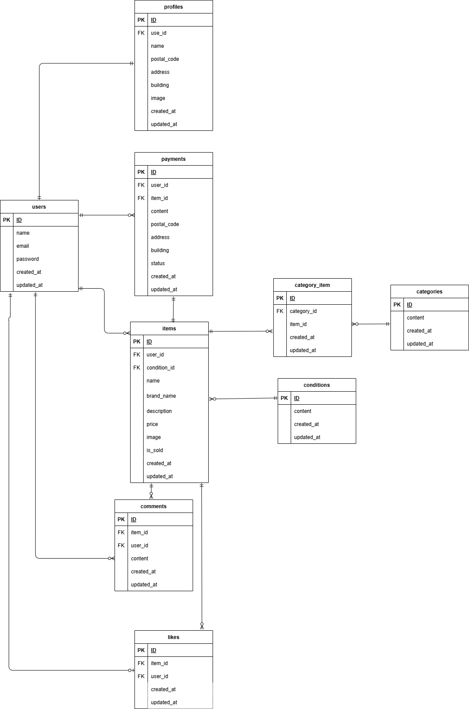

## アプリケーション名
coachtechフリマ

## 環境構築
```
Dockerビルド
1.git clone <リポジトリURL>
2.dockerコンテナを構築
$ docker-compose up -d --build
3.srcディレクトリにある「.env.example」をコピーして 「.env」を作成し DBの設定を変更　
$ cp .env.example .env
---
DB_HOST=mysql
DB_DATABASE=laravel_db
DB_USERNAME=laravel_user
DB_PASSWORD=laravel_pass
---

Laravelをインストール
1docker-compose exec php bash
2 composer install

アプリケーションキーを作成
3 php artisan key:generate

DBのテーブルを作成
4 php artisan migrate

DBのテーブルにダミーデータを投入
5 php artisan db:seed

"The stream or file could not be opened"エラーが発生した場合
ディレクトリ/ファイルの権限を変更
6 sudo chmod -R 777 src/storage

7 ストレージに保存したファイルを表示するためシンボリックリンクを作成
php artisan storage:link
```
## テストユーザ
```
ダミー商品は、ユーザ１がすべて出品しているので
ユーザ２でログインすると出品商品が見れます

ユーザ１
name：山田太郎
email：test@email
password:coachtech

ユーザ２
name：山田次郎
email：test2@email
password:coachtech
```

## テスト環境構築
```
テスト用データベースの作成
docker-compose exec mysql bash
mysql -u root -p

CREATE DATABASE demo_test;
SHOW DATABASES;

テスト用の.envファイルの作成
cp .env .env.testing

APP_ENV=test
APP_KEY=
DB_DATABASE=demo_test
DB_USERNAME=root
DB_PASSWORD=root

テスト用のテーブルの作成
docker-compose exec php bash
php artisan key:generate --env=testing
php artisan config:clear
php artisan migrate --env=testing

テストの実行
php artisan test
```
## 使用技術
```
・PHP8.0
・laravel 10.0
・MySQL 8.0
```

## URL
```
・環境構築：http://localhost/
・phpMyAdmin:http://localhost:8080/
```

## ER図
